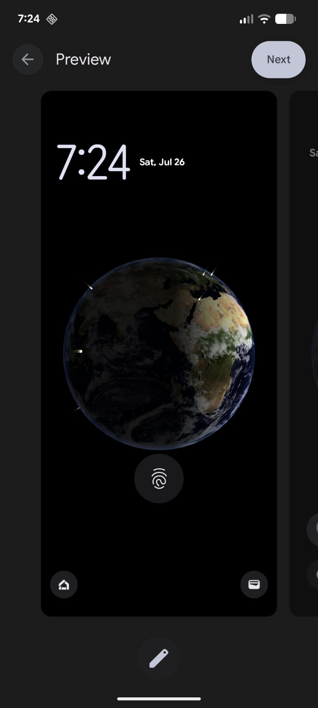
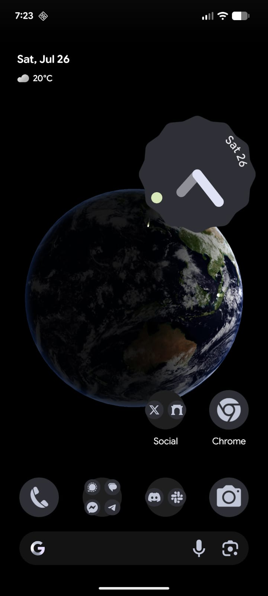

# NSEarth 🌍

**Advanced 3D Earth Live Wallpaper for Android**

NSEarth is a stunning live wallpaper that brings our beautiful planet to your Android device. Experience Earth in full 3D glory with realistic lighting, dynamic city beacons, and optimized performance that respects your device's battery life.

## ✨ Features

- 🌍 **Realistic 3D Earth** - High-resolution Earth textures with cloud layers and atmospheric effects
- ☀️ **Dynamic Sun Lighting** - Realistic sun positioning creates natural day/night cycles with specular reflections
- 🏙️ **City Beacons** - Animated beacons mark major cities worldwide, pulsing with gentle light
- ⚡ **Performance Optimized** - Smart resource management pauses rendering when wallpaper isn't visible
- 🎮 **Smooth Animation** - Optimized 30 FPS rendering provides smooth Earth rotation
- 🔧 **Advanced OpenGL** - Built with modern OpenGL ES 2.0 featuring procedural sphere generation

## 📱 Requirements

- Android 7.0 (API level 24) or higher
- OpenGL ES 2.0 support
- Approximately 10MB storage space

## 🛠️ Technology Stack

- **Kotlin** - Modern Android development
- **OpenGL ES 2.0** - High-performance 3D graphics
- **Android Live Wallpaper Service** - System integration
- **GLSL Shaders** - Custom vertex and fragment shaders
- **Procedural Generation** - Dynamic sphere and texture creation
- **Adaptive Icons** - Modern Android icon system

## 🏗️ Building the Project

1. Clone the repository
2. Open in Android Studio
3. Build and run:
   ```bash
   ./gradlew assembleDebug
   ./gradlew installDebug
   ```

## 🎨 Performance Features

- **Adaptive Frame Rate** - Adjusts between 1-30 FPS based on visibility
- **Smart Resource Management** - Textures released when wallpaper is invisible
- **Optimized Rendering** - Thread pauses during invisibility to save battery
- **Efficient Texture Loading** - Fallback procedural textures when assets are missing

## 📁 Project Structure

```
app/src/main/
├── java/com/example/nsearth/
│   ├── EarthWallpaperService.kt    # Main wallpaper service
│   ├── EarthRenderer.kt            # 3D Earth rendering
│   ├── BeaconRenderer.kt           # City beacon effects
│   ├── TextureUtils.kt             # Texture management
│   ├── ShaderUtils.kt              # Shader compilation
│   ├── ModelLoader.kt              # 3D model loading
│   ├── SphereGenerator.kt          # Procedural sphere generation
│   └── MathUtils.kt                # Mathematical utilities
├── assets/
│   ├── earth_cloudless.jpg         # Earth surface texture
│   ├── earth_clouds.jpg            # Cloud layer texture
│   └── shaders/                    # GLSL shader files
└── res/
    └── drawable/                   # App icons and resources
```

## 🎯 How to Use

1. Install the APK on your Android device
2. Go to Settings → Display → Wallpaper
3. Select "Live Wallpapers"
4. Choose "NSEarth" from the list
5. Enjoy your beautiful rotating Earth wallpaper!

## 🤝 Contributing

Contributions are welcome! This project is open source under the Apache 2.0 License. Feel free to:

- Report bugs or request features via issues
- Submit pull requests for improvements
- Fork the project for your own modifications
- Share your experience and suggestions

## 📄 License

```
Copyright 2025 Adam Sobotka

Licensed under the Apache License, Version 2.0 (the "License");
you may not use this file except in compliance with the License.
You may obtain a copy of the License at

    http://www.apache.org/licenses/LICENSE-2.0

Unless required by applicable law or agreed to in writing, software
distributed under the License is distributed on an "AS IS" BASIS,
WITHOUT WARRANTIES OR CONDITIONS OF ANY KIND, either express or implied.
See the License for the specific language governing permissions and
limitations under the License.
```

## 🌟 Screenshots




---

**Built with passion for our beautiful planet** 🌍

*For more information, visit the [project documentation](index.html)* 